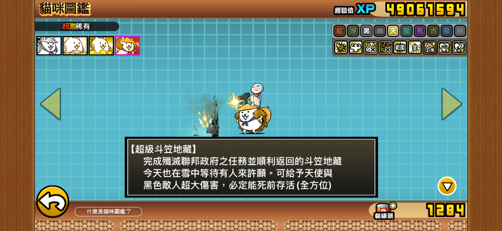

# SwiftUI 形狀練習 - 超級斗笠地藏

行動載具課程第二次作業：只用 SwiftUI 的形狀（Shape、Path）拼出《貓咪大戰爭》的角色「超級斗笠地藏」。

本專案為課堂練習，不作任何商業用途。

## 參考圖

## 使用的形狀與語法

- 內建形狀：`Circle`、`Ellipse`、`Capsule`、`Rectangle`、`RoundedRectangle`
- 自訂 Shape：`Hat`（斗笠）、`Star`（槍口火光）
- `Path`：蓑衣、耳朵、嘴巴、領巾等不規則形狀
- 版面與變形：`ZStack`、`.frame`、`.offset`、`.rotationEffect`
- 顏色：在 `Assets.xcassets` 建立自訂 Color Set

「超級斗笠地藏」角色及《貓咪大戰爭》（にゃんこ大戦争 / The Battle Cats）相關的角色設計、名稱與圖片，版權皆屬 **PONOS Corporation** 所有。本專案僅為個人學習用途的仿繪練習，與 PONOS 無任何關聯。
